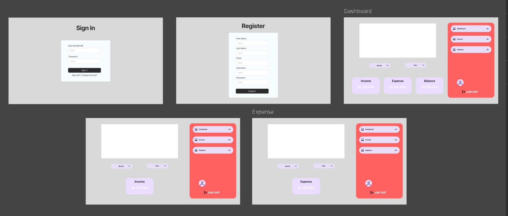
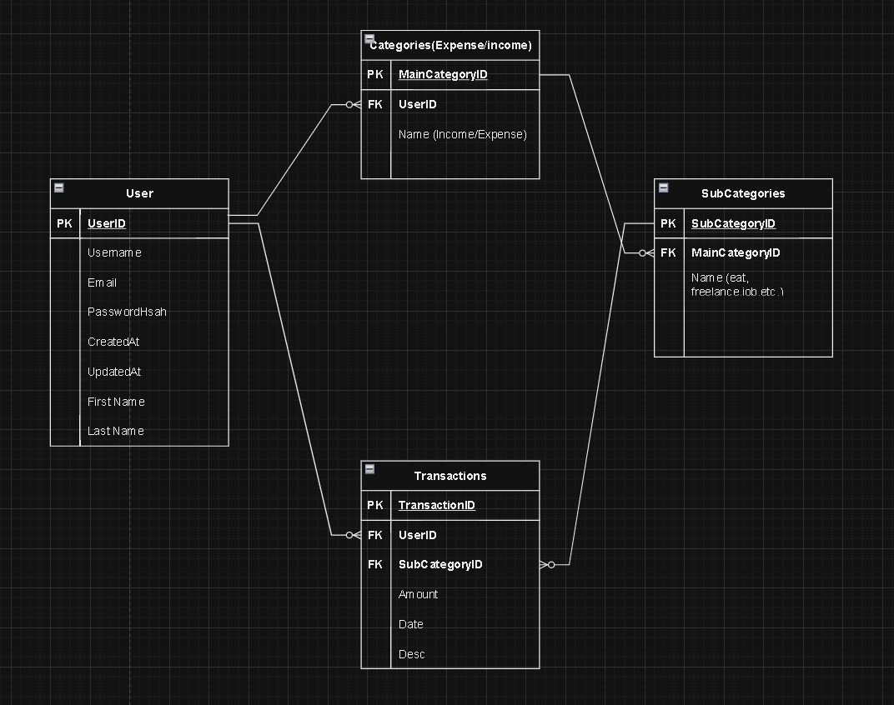

# 🌟 Web Programming Project - B Bangsawan Cina B 🌟

## 📜 Subtitle
Expense Tracker Web Application

## 🖋️ Small Subtitle
A simple web application for tracking personal expenses and income.

## 👥 Team Members
- **Wilson Angelie Tan**  
  NPM: 140810230024

- **Stan Fedheric**  
  NPM: 140810230046

- **Theophilus Samuel Ghozalli**  
  NPM: 140810230054

## ⚙️ Project Functionality
This web application will provide the following features:
- Creation and management of expense and income categories
- Adding and editing transactions
- Tracking and visualizing expenses and income with charts
- Search and filter transactions by category or date

## 🎯 Objectives
The goal of this project is to develop a web application that enables users to:
- Record and monitor their expenses and income effectively
- Help users in budgeting and financial planning
- Provide visual reports to better understand spending and income patterns

## 🎯 Target Users
The intended users of this web application are individuals who want to manage their personal finances better. This includes:
- Students who want to track their monthly expenses
- Professionals who need to manage personal budgets
- Anyone interested in personal financial management

## ✏️ Basic Mockup

[Figma Link](https://www.figma.com/design/7zkiv3bm4tGfWc3Nhbw7gx/Mock-Up-Pem-Web?node-id=9-1635&t=1iGMFpF8jmQVcxkQ-1)

*The image above shows the user interface of the Expense Tracker web.*

## 🗂️ Database Schema
The database schema for this application includes the following tables:
- **Users**: Stores user information
- **Categories**: Stores expense and income categories
- **SubCategories**: Stores speicific categories
- **Transactions**: Stores details of transactions made by users

### Schema Diagram

*The diagram above shows the relationships between tables in the database schema.*

